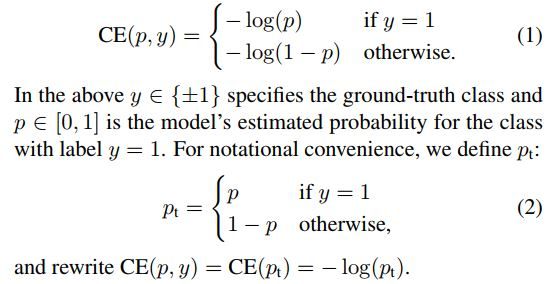
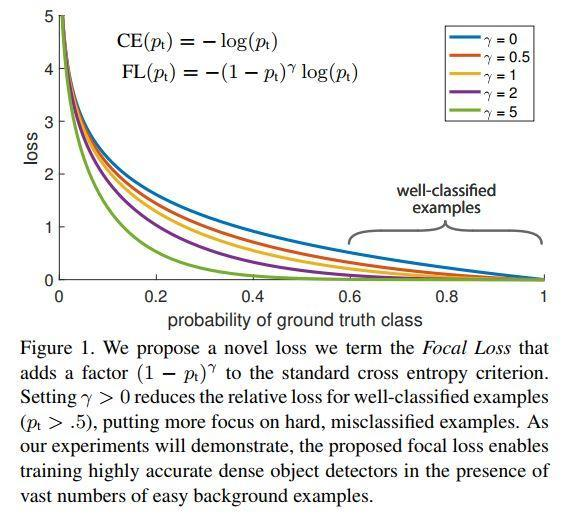
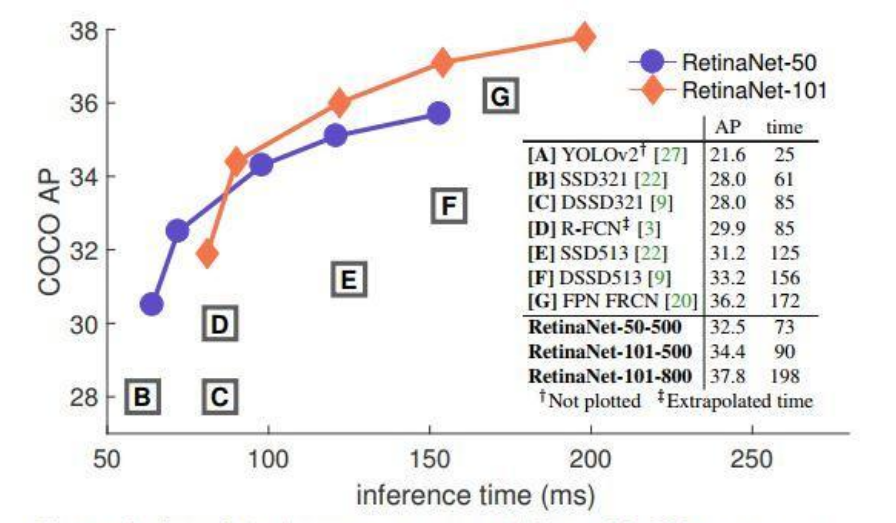

GIthub使用指北:

**1.想将项目拷贝到自己帐号下就fork一下.**

**2.持续关注项目更新就star一下**

**3.watch是设置接收邮件提醒的.**

jupyter-notebook用法例子 请见:[由于Github是国外网站,加载会稍慢](https://github.com/yatengLG/Focal-Loss-Pytorch/blob/master/Demo.ipynb)
 
 retainnet的实现请见:[Retinanet-pytorch](https://github.com/yatengLG/Retinanet-Pytorch)

---

# pytorch 实现 focal loss

[retinanet](https://arxiv.org/abs/1708.02002)论文损失函数

实现过程简易明了,全中文备注.

阿尔法α 参数用于调整类别权重

伽马γ   参数用于调整不同检测难易样本的权重,让模型快速关注于困难样本

## 交叉熵损失

### 带平衡因子的交叉熵

## Focal损失
加入 (1-pt)γ 平衡难易样本的权重,通过γ缩放因子调整,retainnet默认γ=2

### 带平衡因子的Focal损失
论文中最终为带平衡因子的focal loss, 本项目实现的也是这个版本

# 最终retainnet的效果
### 不同γ 值收敛效果

### retainnet与其他检测模型对比

